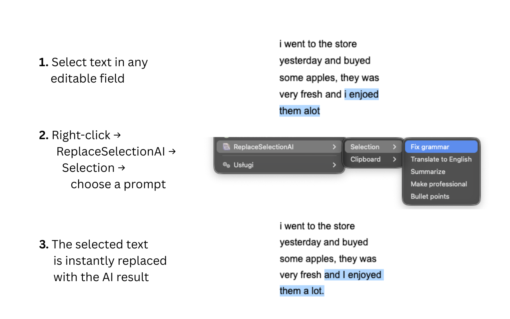
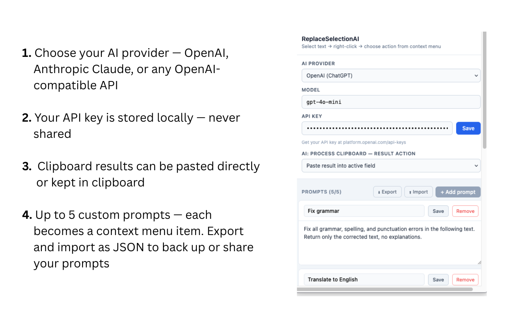

# ReplaceSelectionAI

A Firefox extension that processes selected text (or clipboard content) with AI and automatically replaces it in place — without leaving the page or switching tabs.

## Screenshots

## How it works

1. Select text in any editable field
2. Right-click → choose a prompt from the context menu
3. The selected text is sent to your AI provider and the result replaces the original selection

Alternatively, use the **clipboard mode** to process text from your clipboard and write the result back to it.

## Features

- Define up to 5 custom prompts — each appears as a separate item in the right-click context menu
- Supports **OpenAI** (GPT-4o, GPT-4o-mini), **Anthropic Claude**, and any **OpenAI-compatible provider** (Groq, Mistral, Together AI, and more)
- Works inside iframes and complex web applications
- Export and import prompts as JSON
- Your API key and prompts are stored locally in the browser — nothing is sent anywhere except directly to your chosen AI provider

## Installation

Install from [Firefox Add-ons](https://addons.mozilla.org/firefox/addon/replaceselectionai/).

Or load manually:
1. Clone this repository
2. Open Firefox → `about:debugging` → *This Firefox* → *Load Temporary Add-on*
3. Select `manifest.json`

## Configuration

Click the extension icon in the toolbar to open settings:

- **AI Provider** — choose OpenAI, Anthropic, or any OpenAI-compatible provider
- **Model** — enter the model name (e.g. `gpt-4o-mini`)
- **API Key** — enter your API key (stored locally, never shared)
- **Prompts** — define up to 5 prompts with custom names and instructions

## Use cases

- Translate selected text to another language
- Fix grammar and spelling
- Summarize a paragraph
- Change tone (formal, casual, concise)
- Reformat medical records or lab results into structured lists
- Convert messy notes into bullet points

## Requirements

This extension requires an API key from a paid AI provider. Usage is billed directly by your chosen provider.

## License

MIT
